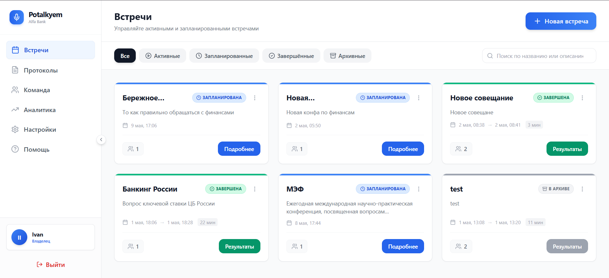
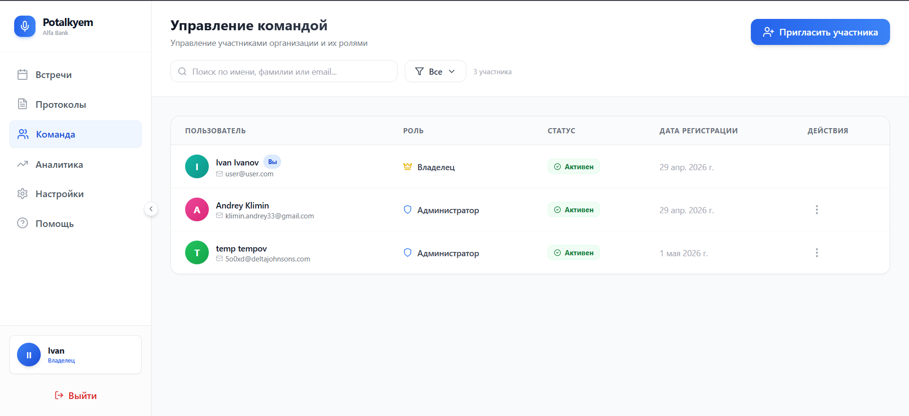
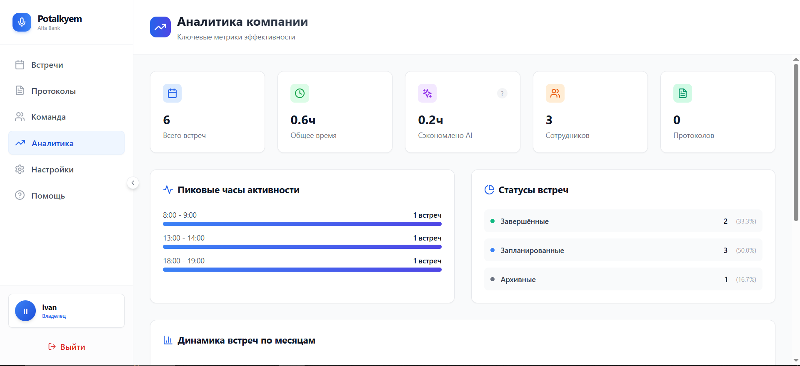
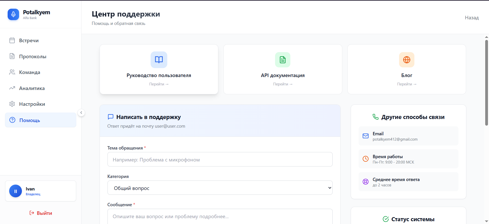
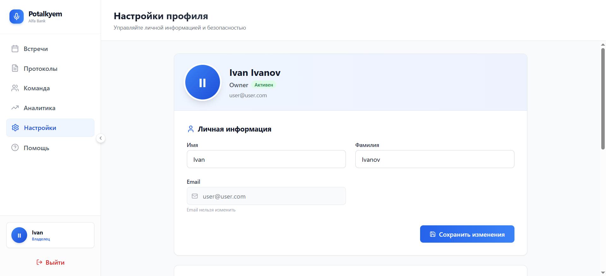

# 🎙️ Potalkyem — AI-платформа для аудиоконференций


> **Дипломный проект** — система для проведения аудиоконференций с AI-протоколами и автоматической расшифровкой встреч.

---

## 📖 О проекте

**Potalkyem** — веб-приложение для аудиоконференций, которое помогает командам проводить встречи, получать автоматическую расшифровку, формировать краткие протоколы и хранить историю обсуждений.

Проект объединяет аудиосвязь, AI-обработку речи, управление участниками и удобный интерфейс для командной работы.

---

## 🎯 Основные возможности

| Функция | Описание |
|--------|---------|
| 🎤 Аудиоконференции | WebRTC P2P-соединения для голосового общения |
| 🤖 AI-протоколы | Автоматическая расшифровка и генерация краткого резюме встречи |
| 💬 Умный чат | Обмен сообщениями, редактирование и ответы |
| 👥 Команды | Управление ролями, участниками и доступом |
| 📊 Аналитика | Метрики встреч и статистика активности |
| 🔒 Безопасность | JWT-аутентификация и разграничение ролей |

---

## 🏗️ Архитектура проекта

```text
platform-new/
├── backend-python/
│   ├── main.py
│   ├── models.py
│   ├── routers/
│   └── requirements.txt
├── frontend/
│   ├── src/
│   ├── public/
│   └── package.json
└── docker-compose.yml
```

---

## 🛠 Технологический стек

### Backend
- FastAPI
- PostgreSQL
- SQLAlchemy
- AsyncPG
- Redis
- OpenAI API

### Frontend
- React 18
- TypeScript
- TailwindCSS

### DevOps
- Docker
- Render

---

## 🚀 Быстрый старт

### 1. Клонирование репозитория

```bash
git clone https://github.com/Klimin0Andrey/TempDiplom.git
cd TempDiplom
```

### 2. Настройка PostgreSQL

```bash
psql -U postgres
```

```sql
CREATE USER platform_user WITH PASSWORD 'password';
CREATE DATABASE platform_db OWNER platform_user;
```

```bash
\q
```

### 3. Запуск backend

```bash
cd backend-python
python -m venv venv
```

#### Windows
```bash
venv\Scripts\activate
```

#### Linux / Mac
```bash
source venv/bin/activate
```

```bash
pip install -r requirements.txt
cp .env.example .env
```

### 4. Запуск backend-сервера

```bash
uvicorn main:app --reload
```

Backend будет доступен по адресу:

- [http://localhost:8000](http://localhost:8000)
- [http://localhost:8000/docs](http://localhost:8000/docs)

### 5. Запуск frontend

```bash
cd ../frontend
npm install
npm run dev
```

Frontend будет доступен по адресу:

- [http://localhost:3000](http://localhost:3000)

### 6. Запуск через Docker

```bash
docker-compose up -d
```

---

## 📸 Скриншоты

| Дашборд встреч | Управление командой |
|:---:|:---:|
|  |  |

| Аналитика | Центр поддержки |
|:---:|:---:|
|  |  |

| Настройки профиля |
|:---:|
|  |

---

## 🔄 Миграция и резервное копирование БД

### Создание дампа

```bash
pg_dump --host=HOST --username=platform_user --dbname=platform_db --file=backup.dump
```

### Восстановление из дампа

```bash
pg_restore --host=localhost --dbname=platform_db backup.dump
```

---

## 🧪 Тестирование

```bash
pytest
npm test
```

---

## 📊 API

| Метод | Endpoint | Описание |
|------|----------|---------|
| POST | `/api/auth/register` | Регистрация пользователя |
| POST | `/api/auth/login` | Вход в систему |
| GET | `/api/rooms` | Получение списка комнат |
| POST | `/api/rooms` | Создание комнаты |
| GET | `/messages` | Получение сообщений чата |
| POST | `/protocol` | Генерация AI-протокола |

---

## 🌐 Демо

Онлайн-версия проекта:

- [Potalkyem Demo](https://potalkyem.onrender.com)

---

## 👥 Команда

- Иванов Иван
- Климин Андрей

---

## 📞 Контакты

- Email: [potalkyem412@gmail.com](mailto:potalkyem412@gmail.com)
- GitHub: [Ваш репозиторий](https://github.com/Klimin0Andrey/TempDiplom)

---

## 📝 Лицензия

Проект распространяется под лицензией **MIT**.